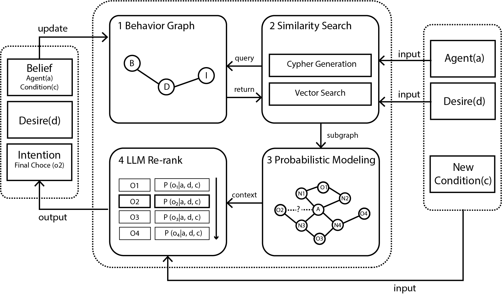
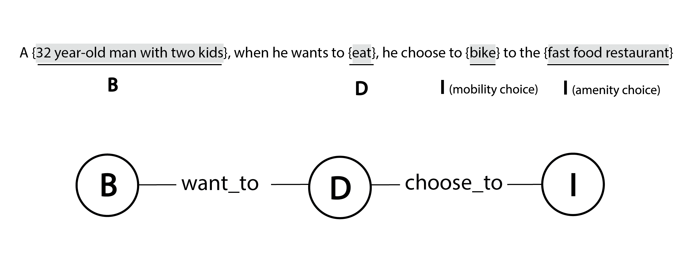
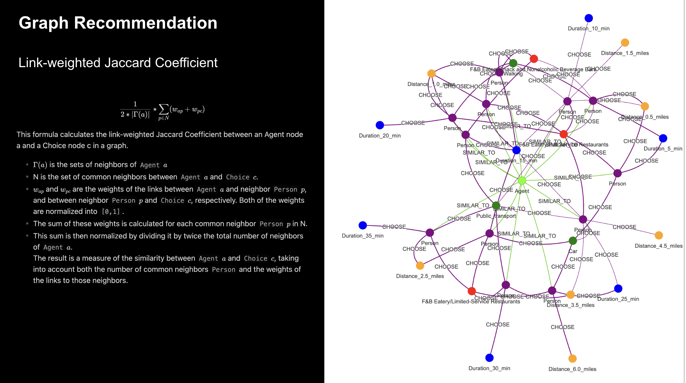
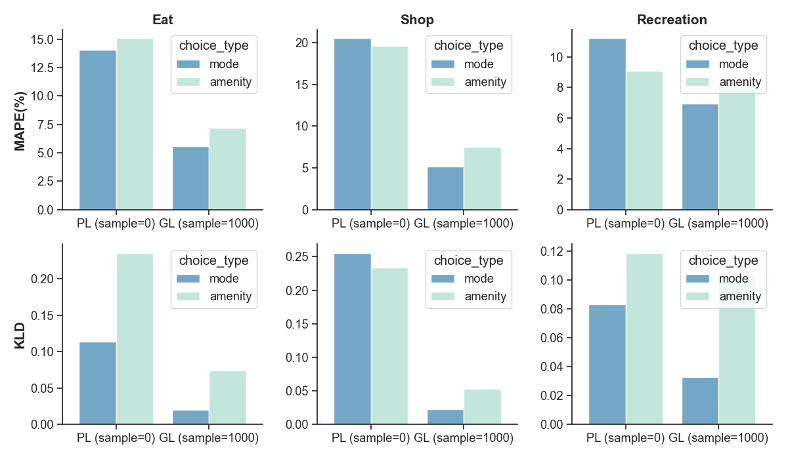
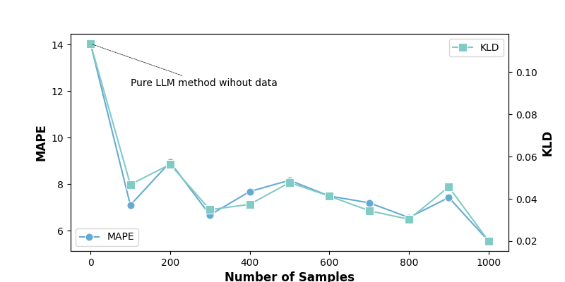

# Graph RAG as Human Choice Model:Building a Data-Driven Simulation Framework with LLM Agents

Studying human behavior in urban environments is a crucial field within city sciences. However, collecting accurate behavioral data, particularly in newly developed areas, poses significant challenges. Recently, generative agents—powered by large language models (LLMs) have emerged as a promising approach to simulate human behaviors in these environments without requiring extensive real-world data. These models can offer valuable insights into human interactions and responses in urban contexts. Despite their potential, generative methods face challenges related to reliability, as they may not always produce consistent or realistic behavior simulations. 

To addresses the limitations of existing approaches in capturing realistic, context-sensitive simulations within limited data, this paper proposes a novel approach that enhances the contextual awareness and behavioral alignment of generative agents across diverse population groups. By leveraging the strengths of Graph Retrieval Augmented Generation (Graph RAG) and LLMs, the proposed approach aims to deliver more robust and realistic behavior simulations. The experimental results indicate that the proposed approach outperforms both popular machine learning methods and standalone LLM-based method within limited data. Additionally, it demonstrates the ability to adapt to changing conditions that are not present in the dataset. These improvements enhance the reliability of AI-driven simulations in urban science, making them more reflective of real-world dynamics.


# Framework



# Steup

### Install Neo4j

To run the model, you'll need `neo4j` installed in your machine first.You can create a neo4j docker container with the following command, you can set your own `data`,`logs` and `conf` folder. If you're using Windows, ensure that the correct path is set.

```
sudo docker run \
    -itd \
    --restart always \
    --publish=7474:7474 --publish=7687:7687 \
    --env NEO4J_AUTH=neo4j/neo4jgraph \
    --volume=$HOME/Documents/neo4j/data:/data \
    --volume=$HOME/Documents/neo4j/logs:/logs \
    --volume=$HOME/Documents/neo4j/conf:/conf \
    --env NEO4J_dbms_memory_pagecache_size=4G \
    --env NEO4J_PLUGINS='["apoc", "graph-data-science"]' \
    --name neo4j \
    neo4j:5.20.0
```

the default user/password used for neo4j is neo4j/neo4jgraph. If you have your own user/password, you'll need to set them manually in `model/utils/init_settings.py`.

### Install Ollama

This model use Ollama to run the local llms, you can download the latest ollama here: https://ollama.com/. Moreover, `nomic-embed-text` and `llama3.1` are used in this model. You can run the following command to download these models once you installed ollama client.

```
ollama pull nomic-embed-text
ollama pull llama3.1
```

### Prepare the environment

```
git clone https://github.com/CityScope/CS_Human_Choice_Model.git
cd CS_Human_Choice_Model
pip install -r requirements.txt
```

### Folder structure

- baseline: baseline model used to compare with proposed method
- data: original data used to train/test models
- model: main entrypoint of the proposed model
- notebook: step by step guidance of how to build this model

### Example usage

Look at the notebook `example_usage.ipynb` for more details. Make sure you have neo4j and ollama running in your machine before executing these codes.

**With Graph RAG**

```
from model import ChoiceModel

# desire can be one of 'Eat,Shop,Recreation'
desire = 'Eat'

profile = 'a young adult with high income'

choice_model = ChoiceModel(
    data_dir='data', desire=desire, sample_num=1000, skip_init=False)

amenity_final_choice, mode_final_choice = choice_model.infer(
    profile=profile,
    city='Boston',
    mode='infer')

print(amenity_final_choice, mode_final_choice)

# 'F&B Eatery/Full-Service Restaurants', 'Car'
```

**Without Graph RAG**

```
from model import ChoiceModel

# desire can be one of 'Eat,Shop,Recreation'
desire = 'Eat'
profile = 'a young adult with high income'

choice_model = ChoiceModel(
    data_dir='data', desire=desire, sample_num=0, skip_init=True)

amenity_final_choice, mode_final_choice = choice_model.infer_without_context(
    profile=profile,
    city='Boston',
    mode='infer'
)

print(amenity_final_choice, mode_final_choice)

# 'F&B Eatery/Full-Service Restaurants', 'Public_transport'
```

# Behavior Graph Dataset

Great thanks to Terasa's amazing researches, the original data is from her work on amenities distribution (https://github.com/CityScope/AmenitiesDistribution.git). It is the trip and demongraphic data in Boston from replica (https://documentation.replicahq.com/docs/transit), combined with amenity analysis.

### BDI Behavior Graph

The construction of behavior graph in this model follows the schema of BDI agents (https://gama-platform.org/wiki/BDIAgents).

- **Belief**: What does the agent know. (profile)
- **Desire**: What the agent want to do. ('Eat','Shop' or 'Recreation')
- **Intension**: The final choice the agent made. (amenity choice, mobility choice)



# Graph recommondation



# Validation

**mobility choice**

comparison of MAPE and KLD between pure LLM (PL) and proposed method (GL)


Comparison of pure LLM method and the proposed methods based on different number of training samples

# Acknowledgement

Sincere gratitude to Luis, Parfait, Carlo, Markus, Terasa, Adrian and Kent for their invaluable advice and guidance. Their insights have greatly contributed to the completion of this work.
