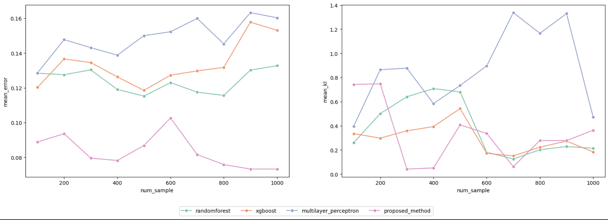
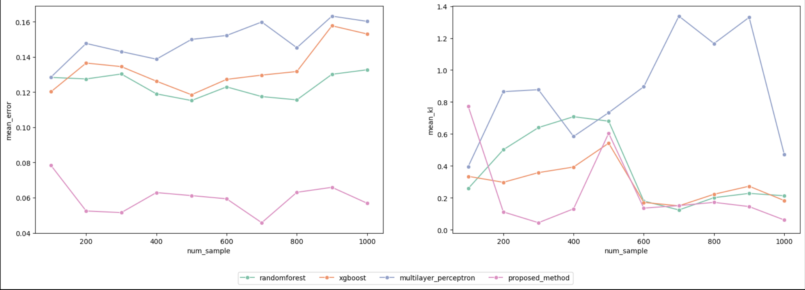

# Graph RAG as Human Choice Model:Building a Data-Driven Simulation Framework with LLM Agents

The study of human behavior in urban environment is an important field in city sciences. However, it's usually not easy to collect behavior data especially in newly developed area. Recently, generative agents provide a way to simulate human behaviors without data using llms. But these generative methods still face the challenge of reliability, as they may not always produce consistent or realistic behavior simulations.

To address this, a hybrid approach is proposed, combining Graph Retrieval-Augmented Generation (Graph RAG) with LLMs. By integrating graph-based retrieval, the model aims to enhance the contextual understanding and accuracy of the generated behaviors with a small amount of data, making the simulations more reliable and reflective of real-world dynamics.

# Framework


# Steup

### Install Neo4j

To run the model, you'll need `neo4j` installed in your machine first.You can create a neo4j docker container with the following command, you can set your own `data`,`logs` and `conf` folder. If you're using Windows, ensure that the correct path is set.

```
docker run \
    -it \
    --restart always \
    --publish=7474:7474 --publish=7687:7687 \
    --env NEO4J_AUTH=neo4j/neo4jgraph \
    --volume=$HOME/Documents/neo4j/data:/data \
    --volume=$HOME/Documents/neo4j/logs:/logs \
    --volume=$HOME/Documents/neo4j/conf:/conf \
    --env NEO4J_dbms_memory_pagecache_size=4G \
    --env NEO4J_PLUGINS='["apoc", "graph-data-science"]' \
    --name neo4j \
    neo4j:5.20.0
```

the default user/password used for neo4j is neo4j/neo4jgraph. If you have your own user/password, you'll need to set them manually in `model/utils/init_settings.py`.

### Install Ollama

This model use Ollama to run the local llms, you can download the latest ollama here: https://ollama.com/. Moreover, `nomic-embed-text` and `llama3.1` are used in this model. You can run the following command to download these models once you installed ollama client.

```
ollama pull nomic-embed-text
ollama pull llama3.1
```

### Prepare the environment

```
git clone https://github.com/CityScope/CS_Human_Choice_Model.git
cd CS_Human_Choice_Model
pip install -r requirements.txt
```

### Folder structure

- baseline: baseline model used to compare with proposed method
- data: original data used to train/test models
- model: main entrypoint of the proposed model
- notebook: step by step guidance of how to build this model

### Example usage

Look at the notebook `example_usage.ipynb` for more details. Make sure you have neo4j and ollama running in your machine before executing these codes.

**With Graph RAG**

```
from model import ChoiceModel

# desire can be one of 'Eat,Shop,Recreation'
desire = 'Eat'

profile = 'a young adult with high income'

choice_model = ChoiceModel(
    data_dir='data', desire=desire, sample_num=1000, skip_init=False)

amenity_final_choice, mode_final_choice = choice_model.infer(
    profile=profile,
    city='Boston',
    mode='infer')

print(amenity_final_choice, mode_final_choice)

# 'F&B Eatery/Full-Service Restaurants', 'Car'
```

**Without Graph RAG**

```
from model import ChoiceModel

# desire can be one of 'Eat,Shop,Recreation'
desire = 'Eat'
profile = 'a young adult with high income'

choice_model = ChoiceModel(
    data_dir='data', desire=desire, sample_num=0, skip_init=True)

amenity_final_choice, mode_final_choice = choice_model.infer_without_context(
    profile=profile,
    city='Boston',
    mode='infer'
)

print(amenity_final_choice, mode_final_choice)

# 'F&B Eatery/Full-Service Restaurants', 'Public_transport'
```

# Behavior Graph Dataset

Great thanks to Terasa's amazing researches, the original data is from her work on amenities distribution (https://github.com/CityScope/AmenitiesDistribution.git). It is the trip and demongraphic data in Boston from replica (https://documentation.replicahq.com/docs/transit), combined with amenity analysis.

### BDI Behavior Graph

The construction of behavior graph in this model follows the schema of BDI agents (https://gama-platform.org/wiki/BDIAgents).

- **Belief**: What does the agent know. (profile)
- **Desire**: What the agent want to do. ('Eat','Shop' or 'Recreation')
- **Intension**: The final choice the agent made. (amenity choice, mobility choice)

# Graph recommondation


# Validation

**mobility choice**

**amenity choice**


# Acknowledgement

Sincere gratitude to Luis, Parfait, Carlo, Markus, Terasa, Adrian and Kent for their invaluable advice and guidance. Their insights have greatly contributed to the completion of this work.
